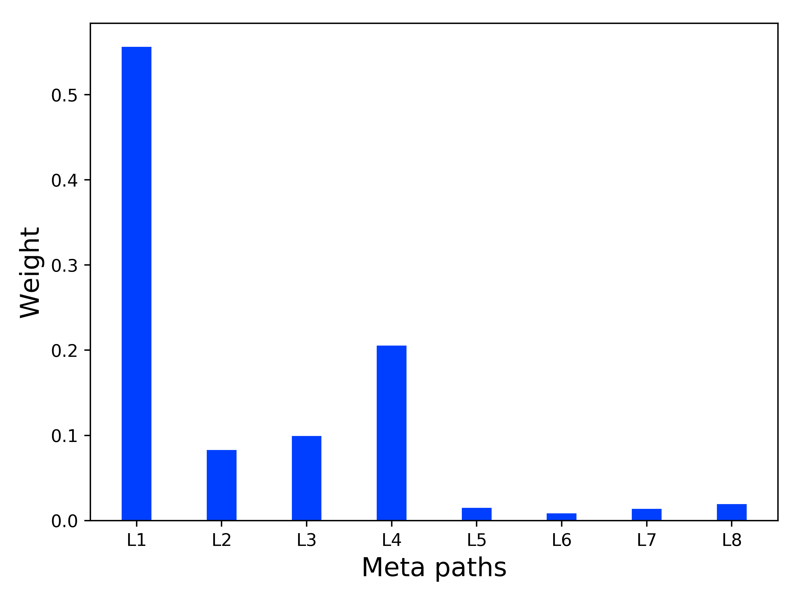
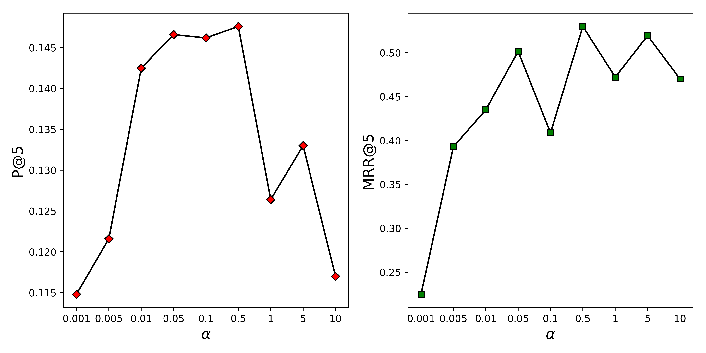
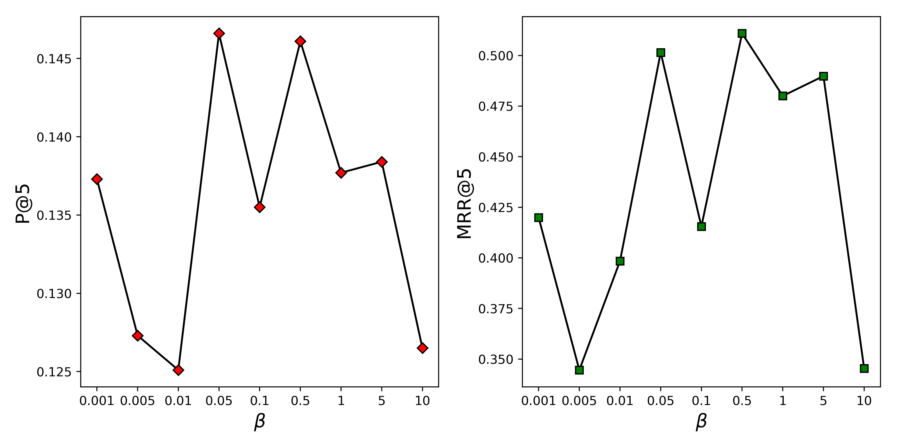
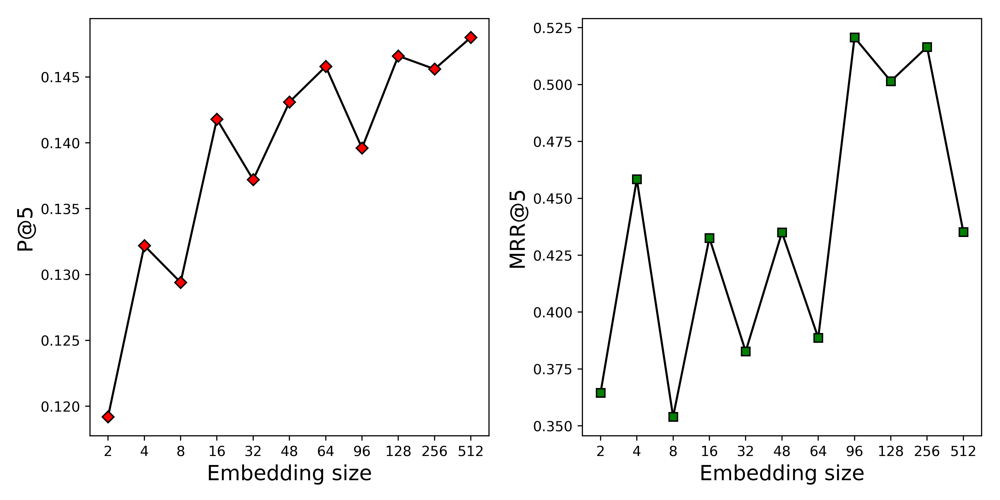
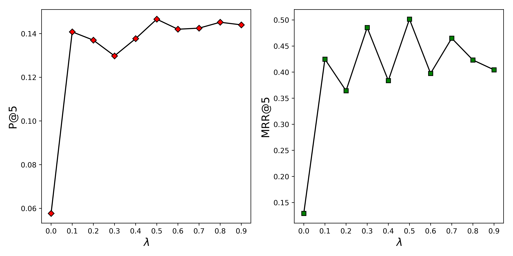

# HINGAN

A GAN-based recommendation approach. 
This is the code accompanying the ICML 2019 paper "Generative Adversarial Network Based Service Recommendation in Heterogeneous Information Networks" Paper link: [https://ieeexplore.ieee.org/abstract/document/8818434]

## Experimental results

### top-3
 
| Methods | Recall | Precision | MRR | NDCG | 
|:-----:|:----:|:----:|:---:|:---:|
|BPR-SVD|0.2947|0.1321|0.2345|0.2637
|BPRSLIM|0.0585|0.0328|0.0523|0.0617|
|SVD|0.2350|0.1069|0.1893|0.2134|
|POP|0.2223|0.1203|0.2467|0.2586|
|PaSRec|0.6894|0.3143|0.7717|0.7269|
|IRGAN| 0.3171| 0.1418 |  0.2137 |0.2177|
|CFGAN|0.3216 |0.1472| 0.3331 |0.3020
|**Ours**|0.4917| 0.2203| 0.4926| 0.4570

### top5

| Methods | Recall | Precision | MRR | NDCG | 
|:-----:|:----:|:----:|:---:|:---:|
|BPR-SVD|0.3629|0.1000|0.2585|0.2966
|BPRSLIM|0.0849|0.0300|0.0640|0.0768|
|SVD|0.3434|0.0962|0.2253|0.2653|
|POP|0.2929|0.1000|0.2785|0.2947|
|PaSRec|0.7253|0.2046|0.7901|0.7360|
|IRGAN| 0.3703|0.1038 | 0.2281| 0.2400
|CFGAN|0.3806 | 0.1087 | 0.3471 | 0.3260
|**Ours**|0.5295 |0.1466| 0.5015 |0.4705

### top10

| Methods | Recall | Precision | MRR | NDCG | 
|:-----:|:----:|:----:|:---:|:---:|
|BPR-SVD|0.4691|0.0665|0.2822|0.3343
|BPRSLIM|0.1183|0.0223|0.0737|0.0892|
|SVD|0.4791|0.0686|0.2533|0.3127|
|POP|0.4051|0.0692|0.3040|0.3349|
|PaSRec|0.7727|0.1131|0.8048|0.7428|
|IRGAN|0.4474 |0.0643 |  0.2379| 0.2658
|CFGAN|0.4621 |0.0675 |0.3602 |0.3551
|**Ours**|0.5635 |0.0799|0.5060 |0.4820

### The importance of 8 metal paths

m-s-m-s is the most important

### impact on hyperparameters

&alpha; 是G模型的正则化参数，同CFGAN

---

&beta; 是G模型的正则化参数

----

Embedding size; 每个特征embedding的维度

&lambda; 把训练集抽样为负样本的比例，CFGAN中是
按个数抽，这里是按照比例抽。

